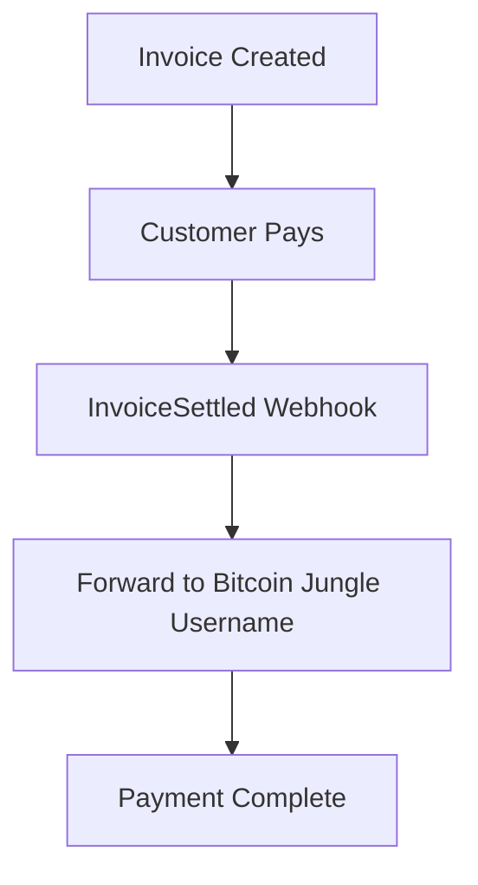
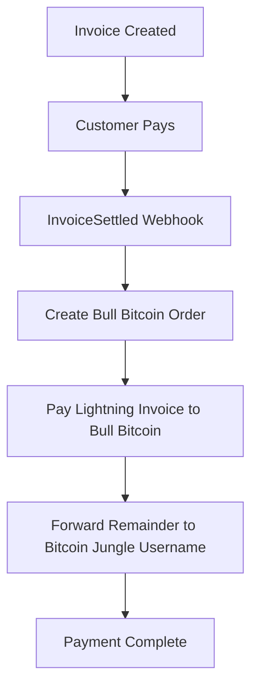
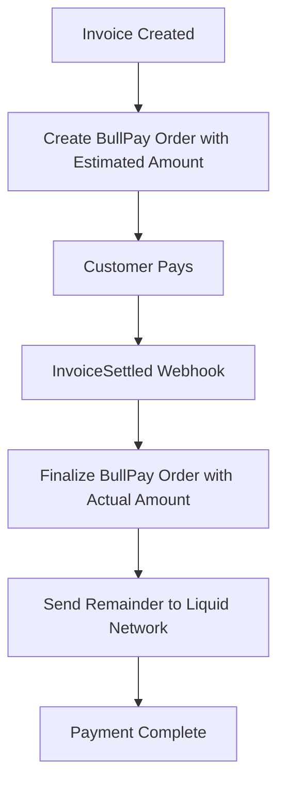

# Bitcoin Jungle Payment Forwarding API Documentation

Complete API documentation for integrating with the Bitcoin Jungle Payment Forwarding system, covering all three payment flows: Regular Bitcoin Jungle, BullBitcoin, and BullPay.

## Table of Contents

1. [Overview](#overview)
2. [Authentication](#authentication)
3. [Payment Flows](#payment-flows)
4. [API Endpoints](#api-endpoints)
5. [Store Configuration](#store-configuration)
6. [Webhook Events](#webhook-events)
7. [Error Handling](#error-handling)
8. [Integration Examples](#integration-examples)

---

## Overview

The Bitcoin Jungle Payment Forwarding system supports three distinct payment flows:

### 1. **Regular Bitcoin Jungle Flow**
- **Use Case:** Standard Lightning Network payments
- **Settlement:** Direct Lightning payments to Bitcoin Jungle usernames
- **Processing:** Single-phase on invoice settlement

### 2. **BullBitcoin Flow**
- **Use Case:** Lightning-to-fiat conversion via Bull Bitcoin
- **Settlement:** Partial conversion to fiat + remainder to Lightning
- **Processing:** Single-phase on invoice settlement

### 3. **BullPay Flow** *(NEW)*
- **Use Case:** Lightning-to-fiat conversion with Liquid Network settlement
- **Settlement:** Partial conversion to fiat + remainder to Liquid Network
- **Processing:** Two-phase (order creation + finalization)

---

## Authentication

### HMAC-SHA256 Webhook Verification
All webhook endpoints (except those in `noAuthPaths`) require HMAC-SHA256 verification:

```javascript
const crypto = require('crypto')
const test = crypto.createHmac('sha256', webhookSecret).update(rawBody).digest("hex")
const sig = req.headers['btcpay-sig'].replace('sha256=', '')
// Verify: test === sig
```

### API Key Authentication
Store management endpoints require an internal API key:

```json
{
  "apiKey": "your_internal_api_key"
}
```

---

## Payment Flows

### 🔄 **Regular Bitcoin Jungle Flow**



**Characteristics:**
- ✅ Simple single-phase processing
- ✅ Direct Lightning Network forwarding
- ✅ Tips handled via Lightning
- ✅ SMS notifications supported

---

### 🔄 **BullBitcoin Flow**



**Characteristics:**
- ✅ Single-phase processing on settlement
- ✅ Partial conversion to fiat (configurable %)
- ✅ Remainder forwarded via Lightning
- ✅ Tips handled via Lightning
- ✅ SMS notifications supported

---

### 🔄 **BullPay Flow** *(NEW)*



**Characteristics:**
- ✅ Two-phase processing (creation + finalization)
- ✅ Rate locking on invoice creation
- ✅ Partial conversion to fiat (configurable %)
- ✅ Remainder sent to Liquid Network
- ✅ Tips handled via Lightning
- ✅ Complete metadata tracking
- ✅ SMS notifications supported

---

## API Endpoints

### Store Management

#### `POST /addStore`
Creates a new store with payment forwarding configuration.

**Request:**
```json
{
  "apiKey": "your_internal_api_key",
  "storeName": "My Bitcoin Store",
  "storeOwnerEmail": "owner@example.com",
  "defaultCurrency": "USD",
  "defaultLanguage": "en",
  "rate": "0.995",
  "bitcoinJungleUsername": "merchant_username",
  "tipSplit": ["tip_user1", "tip_user2"],
  
  // For BullBitcoin stores (optional)
  "bullBitcoin": {
    "percent": 50,
    "recipientId": "bull_bitcoin_recipient_id",
    "token": "bull_bitcoin_api_token",
    "userId": "bull_bitcoin_user_id"
  },
  
  // For BullPay stores (optional)
  "bullPay": {
    "percent": 30,
    "currency": "USD",
    "token": "bull_bitcoin_api_token", 
    "userId": "bull_bitcoin_user_id"
  },
  "liquidWalletDescriptor": "ct(slip77(...),elwpkh([...]xpub...))"
}
```

**Response:**
```json
{
  "success": true,
  "error": false,
  "btcPayServerAppId": "app_id_here"
}
```

**Validation Rules:**
- ❌ Store cannot have both `bullBitcoin` and `bullPay`
- ✅ `bullPay` requires `liquidWalletDescriptor`
- ✅ `liquidWalletDescriptor` validated via Cyphernode
- ✅ All tip users must be valid Bitcoin Jungle usernames

---

#### `GET /findStores`
Retrieves stores associated with a Bull Bitcoin user ID.

**Request:**
```
GET /findStores?userId={userId}&hash={hash}
```

**Hash Generation:**
```javascript
const date = new Date().getUTCFullYear() + '-' + (new Date().getUTCMonth() + 1) + '-' + new Date().getUTCDate()
const hash = crypto.createHmac('sha256', webhookSecret).update(userId + date).digest('hex')
```

**Response:**
```json
{
  "success": true,
  "error": false,
  "data": [
    {
      "id": 1,
      "storeId": "btcpay_store_id",
      "rate": "0.995",
      "bitcoinJungleUsername": "merchant",
      "appId": "btcpay_app_id",
      "btcpayStore": { /* BTCPay store object */ },
      "bullBitcoin": "{\"percent\":50,\"recipientId\":\"...\",\"userId\":\"...\"}"
    }
  ]
}
```

---

### Tip Management

#### `GET /getTipConfiguration`
Retrieves tip configuration for a store.

**Request:**
```
GET /getTipConfiguration?appId={btcPayAppId}
```

**Response:**
```json
{
  "success": true,
  "error": false,
  "data": [
    {
      "bitcoinJungleUsername": "tip_user1"
    },
    {
      "bitcoinJungleUsername": "tip_user2" 
    }
  ]
}
```

---

#### `POST /setTipSplit`
Updates tip split configuration for a store.

**Request:**
```json
{
  "appId": "btcpay_app_id",
  "tipUsernames": ["tip_user1", "tip_user2"]
}
```

**Response:**
```json
{
  "success": true,
  "error": false
}
```

---

### LNURL Integration

#### `GET /tipLnurl/:appId`
Generates LNURL for tip payments.

**Request:**
```
GET /tipLnurl/{btcPayAppId}?amount={satoshis}&comment={message}
```

**Response:**
```json
{
  "pr": "lnbc...",
  "routes": []
}
```

---

### Webhook Processing

#### `POST /forward`
Main webhook endpoint for BTCPay Server events.

**Supported Events:**
- `InvoiceCreated` - For BullPay order creation
- `InvoiceSettled` - For all payment processing

**Request (InvoiceCreated):**
```json
{
  "type": "InvoiceCreated",
  "storeId": "btcpay_store_id",
  "invoiceId": "btcpay_invoice_id",
  "timestamp": 1640995200
}
```

**Request (InvoiceSettled):**
```json
{
  "type": "InvoiceSettled", 
  "storeId": "btcpay_store_id",
  "invoiceId": "btcpay_invoice_id",
  "timestamp": 1640995200,
  "metadata": {
    "buyerEmail": "+15551234567@btcpayserver.com"
  }
}
```

**Response:**
```json
HTTP 200 OK
```

---

## Store Configuration

### Regular Bitcoin Jungle Store
```json
{
  "storeName": "Regular Store",
  "storeOwnerEmail": "owner@example.com", 
  "defaultCurrency": "USD",
  "defaultLanguage": "en",
  "rate": "0.995",
  "bitcoinJungleUsername": "merchant_username",
  "tipSplit": ["tip_user1", "tip_user2"]
}
```

### BullBitcoin Store
```json
{
  "storeName": "BullBitcoin Store",
  "storeOwnerEmail": "owner@example.com",
  "defaultCurrency": "USD", 
  "defaultLanguage": "en",
  "rate": "0.995",
  "bitcoinJungleUsername": "merchant_username",
  "bullBitcoin": {
    "percent": 50,
    "recipientId": "bull_bitcoin_recipient_id",
    "token": "bull_bitcoin_api_token",
    "userId": "bull_bitcoin_user_id"
  }
}
```

### BullPay Store
```json
{
  "storeName": "BullPay Store",
  "storeOwnerEmail": "owner@example.com",
  "defaultCurrency": "USD",
  "defaultLanguage": "en", 
  "rate": "0.995",
  "bitcoinJungleUsername": "merchant_username",
  "bullPay": {
    "percent": 30,
    "currency": "USD",
    "token": "bull_bitcoin_api_token",
    "userId": "bull_bitcoin_user_id"
  },
  "liquidWalletDescriptor": "ct(slip77(...),elwpkh([...]xpub...))"
}
```

---

## Webhook Events

### InvoiceCreated (BullPay Only)
Triggered when a new invoice is created for BullPay stores.

**Processing:**
1. Extract expected Bitcoin amount from payment methods
2. Calculate estimated conversion amount (percent × amount)
3. Create BullPay order with estimated amount
4. Store order ID in database
5. Update invoice metadata with order summary

**Metadata Added:**
```json
{
  "bullPayOrderSummary": { /* order details */ },
  "bullPayOrderId": "bullpay_order_id",
  "bullPayStatus": "created",
  "bullPayCreatedAt": "2024-01-25T14:30:00.000Z"
}
```

---

### InvoiceSettled (All Store Types)
Triggered when an invoice payment is confirmed.

#### Regular Bitcoin Jungle Processing:
1. Forward full amount to `bitcoinJungleUsername`
2. Process tips if configured
3. Send SMS notification
4. Mark invoice as processed

#### BullBitcoin Processing:
1. Create Bull Bitcoin order for conversion percentage
2. Pay Lightning invoice to Bull Bitcoin
3. Forward remainder to `bitcoinJungleUsername`
4. Process tips if configured  
5. Send SMS notification
6. Mark invoice as processed

#### BullPay Processing:
1. Retrieve stored BullPay order ID
2. Finalize order with actual payment amount
3. Send remainder to Liquid Network via Cyphernode
4. Process tips via Lightning (tips don't go to Liquid)
5. Send SMS notification with Liquid details
6. Update metadata with final transaction details
7. Mark invoice as processed

**Final Metadata (BullPay):**
```json
{
  "bullPayOrderSummary": { /* final order details */ },
  "bullPayStatus": "completed",
  "bullPayFinalizedAt": "2024-01-25T14:35:00.000Z",
  "bullPayActualAmount": 0.0025,
  "liquidTransaction": {
    "hash": "liquid_tx_hash",
    "address": "liquid_address", 
    "status": "accepted",
    "details": { /* transaction details */ }
  },
  "liquidTransactionProcessedAt": "2024-01-25T14:35:30.000Z",
  "liquidTransactionAmount": 0.00175
}
```

---

## Error Handling

### Common Error Responses

#### Validation Errors
```json
{
  "success": false,
  "error": true,
  "message": "Specific error message"
}
```

#### Authentication Errors
```http
HTTP 401 Unauthorized
```

#### Processing Errors
```http
HTTP 404 Not Found
HTTP 500 Internal Server Error
```

### BullPay Specific Errors

#### Invalid Liquid Descriptor
```json
{
  "success": false,
  "error": true, 
  "message": "Invalid liquidWalletDescriptor format"
}
```

#### Cyphernode Unavailable
```json
{
  "success": false,
  "error": true,
  "message": "Cannot validate liquidWalletDescriptor: Cyphernode service not available"
}
```

#### Mutual Exclusion Violation
```json
{
  "success": false,
  "error": true,
  "message": "Store cannot have both bullBitcoin and bullPay configurations"
}
```

---

## Integration Examples

### Creating a Regular Store

```javascript
const response = await fetch('/addStore', {
  method: 'POST',
  headers: { 'Content-Type': 'application/json' },
  body: JSON.stringify({
    apiKey: 'your_api_key',
    storeName: 'My Lightning Store',
    storeOwnerEmail: 'owner@example.com',
    defaultCurrency: 'USD',
    defaultLanguage: 'en',
    rate: '0.995',
    bitcoinJungleUsername: 'merchant_username',
    tipSplit: ['tip_user1', 'tip_user2']
  })
})

const result = await response.json()
console.log('Store created:', result.btcPayServerAppId)
```

### Creating a BullPay Store

```javascript
const response = await fetch('/addStore', {
  method: 'POST',
  headers: { 'Content-Type': 'application/json' },
  body: JSON.stringify({
    apiKey: 'your_api_key',
    storeName: 'My BullPay Store',
    storeOwnerEmail: 'owner@example.com',
    defaultCurrency: 'USD',
    defaultLanguage: 'en',
    rate: '0.995',
    bitcoinJungleUsername: 'merchant_username',
    bullPay: {
      percent: 30,
      currency: 'USD',
      token: 'bull_bitcoin_token',
      userId: 'bull_user_id'
    },
    liquidWalletDescriptor: 'ct(slip77(...),elwpkh([...]xpub...))'
  })
})

const result = await response.json()
if (result.success) {
  console.log('BullPay store created:', result.btcPayServerAppId)
} else {
  console.error('Error:', result.message)
}
```

### Processing Webhook Events

```javascript
// Webhook endpoint handler
app.post('/btcpay-webhook', (req, res) => {
  // Verify HMAC signature
  const signature = req.headers['btcpay-sig']
  const hash = crypto.createHmac('sha256', webhookSecret)
    .update(req.rawBody)
    .digest('hex')
  
  if (`sha256=${hash}` !== signature) {
    return res.status(401).send('Invalid signature')
  }
  
  // Process event
  const { type, storeId, invoiceId } = req.body
  
  switch (type) {
    case 'InvoiceCreated':
      console.log(`Invoice created: ${invoiceId}`)
      // BullPay order creation happens automatically
      break
      
    case 'InvoiceSettled':
      console.log(`Invoice settled: ${invoiceId}`)
      // Payment forwarding happens automatically
      break
  }
  
  res.sendStatus(200)
})
```

### Querying Store Information

```javascript
// Generate authentication hash
const userId = 'bull_bitcoin_user_id'
const date = new Date().getUTCFullYear() + '-' + 
             (new Date().getUTCMonth() + 1) + '-' + 
             new Date().getUTCDate()
const hash = crypto.createHmac('sha256', webhookSecret)
  .update(userId + date)
  .digest('hex')

// Query stores
const response = await fetch(`/findStores?userId=${userId}&hash=${hash}`)
const result = await response.json()

if (result.success) {
  result.data.forEach(store => {
    console.log(`Store: ${store.storeName} (${store.storeId})`)
  })
}
```

---

## Key Differences Summary

| Feature | Regular | BullBitcoin | BullPay |
|---------|---------|-------------|---------|
| **Processing** | Single-phase | Single-phase | Two-phase |
| **Webhook Events** | InvoiceSettled | InvoiceSettled | InvoiceCreated + InvoiceSettled |
| **Rate Locking** | N/A | At settlement | At invoice creation |
| **Conversion** | None | Lightning → Fiat | Lightning → Fiat |
| **Remainder Settlement** | Lightning | Lightning | Liquid Network |
| **Configuration Required** | Username only | Bull Bitcoin account | Bull Bitcoin + Liquid descriptor |
| **Metadata Tracking** | Basic | Basic | Comprehensive |
| **Tips** | Lightning | Lightning | Lightning |

---

## Environment Variables

```bash
# Core Configuration
port=3000
webhookSecret=your_webhook_secret
btcpayBaseUri=https://your-btcpay-instance.com/
btcpayApiKey=your_btcpay_api_key
internalKey=your_internal_api_key

# Bitcoin Jungle
lnUrlBaseUri=https://api.mainnet.bitcoinjungle.app

# Bull Bitcoin
# (API key and credentials configured per store)

# Cyphernode (for BullPay)
cyphernodeBaseUrl=https://your-cyphernode-instance.com
cyphernodeApiId=your_cyphernode_api_id  
cyphernodeApiKey=your_cyphernode_api_key

# Notifications
twilioAccountSid=your_twilio_sid
twilioAuthToken=your_twilio_token
twilioPhoneNumber=+1234567890
```

This API documentation provides complete integration guidance for all three payment flows supported by the Bitcoin Jungle Payment Forwarding system.
